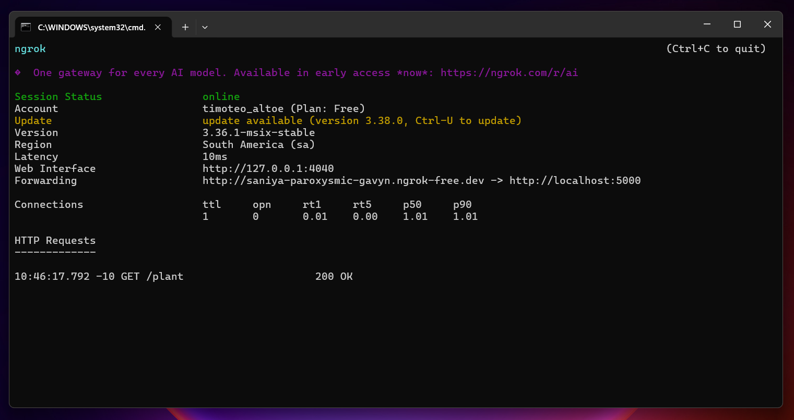

# Wokwi - Estufa Inteligente

Projeto de estufa inteligente simples, desenvolvido com um ESP32 no ambiente simulado Wokwi.

## Funcionamento

O projeto funciona da seguinte forma:
- Ao iniciar a simulação no Wokwi, o usuário tem a possibilidade de digitar o nome de uma planta no terminal;
- Ao pressionar "Enter", o programa envia o nome da planta (via API) a um modelo de Inteligência Artificial;
- A IA, então, define quais são as condições ideais (de temperatura, umidade e luminosidade) para aquela planta específica;
- Definidos os parâmtros, a API retorna essas informações para que o programa atualize seus thresholds;
- Com base nos novos thresholds, o microcontrolador ativará os atuadores binários - ventilador, lâmpada e umidificador, representados pelos LEDs verde, vermelho e azul, respectivamente -, a depender dos valores medidos pelos sensores;
  - Caso a temperatura esteja acima do ideal, o ventilador (LED verde) será acionado;
  - Caso a luminosidade esteja abaixo do ideal, a lâmpada (LED vermelho) será acionada;
  - Caso a umidade esteja abaixo do ideal, o umidificador (LED azul) será acionado.

## Interfaces

### Simulação no Wokwi

#### Código principal

> Para ver o código (raw file), acesse: [main.py](https://github.com/imbaTIMvel/empreendaiot_examples/tree/main/esp32_wokwi_smart_greenhouse/main.py)

O código principal exerce a função de:
- Receber entrada do usuário (input() ou valor fixo)
- Fazer requisição HTTP pra API
- Realizar a leitura dos sensores:
  - LDR (fotorresistor via ADC)
  - DHT22 (temperatura + umidade)
- Comparar com thresholds
- Controlar os LEDs (p/ representar atuadores binários):
  - LED verde (ventilador)
  - LED vermelho (luz)
  - LED azul (água/umidificador)

#### Diagrama

> Para ver o diagrama (raw file), acesse: [diagram.json](https://github.com/imbaTIMvel/empreendaiot_examples/tree/main/esp32_wokwi_smart_greenhouse/diagram.json)

O diagrama faz uso dos seguintes componentes:
- 1 ESP32
- 1 Módulo sensor fotorresistor (LDR)
- 1 Sensor digital de temperatura e umidade (DHT22)
- 3 LEDs 5mm padrão:
  - 1 verde
  - 1 vermelho
  - 1 azul
- 3 resistores de 220 Ω

Seguindo o seguinte esquema de conexões:

| ESP32 | Intermediário | LDR | DHT22 | LED verde | LED vermelho | LED azul |
| ----- | ------------- | --- | ----- | --------- | ------------ | -------- |
|  3V3  |      ---      | VCC |  VCC  |    ---    |      ---     |    ---   |
|  GND  |      ---      | GND |  GND  |     C     |       C      |     C    |
|   4   |      ---      | --- |  SDA  |    ---    |      ---     |    ---   |
|   16  | Resistor 220Ω | --- |  ---  |     A     |      ---     |    ---   |
|   17  | Resistor 220Ω | --- |  ---  |    ---    |       A      |    ---   |
|   18  | Resistor 220Ω | --- |  ---  |    ---    |      ---     |     A    |
|   34  |      ---      |  AO |  ---  |    ---    |      ---     |    ---   |

Como pode ser visto na imagem a seguir:


### Servidor local

> Para ver o código (raw file), acesse: [greenhouse_server.py](https://github.com/imbaTIMvel/empreendaiot_examples/tree/main/esp32_wokwi_smart_greenhouse/server/greenhouse_server.py)

O servidor local exerce a função de:
- Receber o nome da planta a partir da entrada fornecida pelo usuário (via terminal Wokwi)
- Consultar a IA (modelo: llama-3.1-8b-instant) da Groq
- Receber e retornar JSON com thresholds

## Configuração

Segue, abaixo, o passo a passo para configurar e executar o programa no ambiente simulado Wokwi:
1. No site [Wokwi](https://wokwi.com), selecione a aba "My Projects" no seu perfil e clique no botão "New Project"
2. Selecione o microcontrolador ESP32 padrão (1ª opção), optando pelo "Beginner template" em Micropython
3. Na aba "main.py", substitua o template pelo código Python disponível em: [main.py](https://github.com/imbaTIMvel/empreendaiot_examples/tree/main/esp32_wokwi_smart_greenhouse/main.py)
4. Na aba "diagram.json", substitua o template pelo JSON disponível em: [diagram.json](https://github.com/imbaTIMvel/empreendaiot_examples/tree/main/esp32_wokwi_smart_greenhouse/diagram.json)
5. Feito isso, abra o Visual Studio Code
6. Crie um novo arquivo .py e copie o código Python disponível em: [greenhouse_server.py](https://github.com/imbaTIMvel/empreendaiot_examples/tree/main/esp32_wokwi_smart_greenhouse/server/greenhouse_server.py)
7. Antes de ativar o servidor, certifique-se de ter Python, Flask e a biblioteca requests instalados em sua máquina
   - Para fazê-lo no Windows, abra o Command Prompt pressionando Windows + R, digitando "cmd" e clicando em "OK"
     - Para conferir se o Python está instalado, digite ```python --version``` no Command Prompt e pressione "Enter"
       - Se o Python não estiver instalado, baixe o instalador clicando [aqui](https://www.python.org/downloads/)
     - Para conferir se o Flask está instalado, digite ```flask --version``` no Command Prompt e pressione "Enter"
       - Se o Flask não estiver instalado, instale-o digitando ```pip install flask``` no Command Prompt e pressionando "Enter"
     - Para conferir se a biblioteca Requests está instalada, digite ```pip show requests``` no Command Prompt e pressione "Enter"
       - Se a biblioteca Requests não estiver instalada, instale-a digitando ```python -m pip install requests``` no Command Prompt e pressionando "Enter"
8. Antes de ativar o servidor, também é necessário criar uma chave API
   - Para fazê-lo, vá até o site [GroqCloud](https://console.groq.com/home), na aba "API Keys" e clique no botão "Create API Key"
     - **ATENÇÃO!** Após criar sua chave, certifique-se de anotá-la em um lugar seguro, pois ela não poderá mais ser copiada do site após sua criação
   - Criada a chave, coloque-a no espaço designado no código do servidor (aberto no Visual Studio Code, perto do topo):
```python
HEADERS = {
    "Authorization": "Bearer SUA-CHAVE-AQUI",
    "Content-Type": "application/json"
}
```
9. Feito isso, ative o servidor executando o código Python
10. Após a ativação do servidor, é necessário expor a API para que o Wokwi consiga acessá-la
    - Para fazê-lo, vá até o site [ngrok](https://dashboard.ngrok.com/get-started/setup/windows), na aba "Identity & Access", seção "Authtokens" e crie um novo token de autenticação
    - Criado o Authtoken, configure-o em sua máquina via Command Prompt
      - Para fazê-lo, digite ```ngrok config add-authtoken SEU-TOKEN-AQUI``` inserindo o Authtoken no espaço designado e pressionando "Enter" 
    - Feito isso, exponha a API digitando ```ngrok http 5000 --scheme=http``` no Command Prompt e pressionando "Enter"
> [!Warning]
> É importante que o port (número inserido ao expor a API, ou seja, neste caso, 5000) inserido no Command Prompt seja o mesmo especificado no código do servidor (aberto no Visual Studio Code) - vide última linha:
> ```python
> app.run(host="0.0.0.0", port=5000)
> ```

11. Exposta a API, seu Command Prompt deve mostrar algo semelhante à imagem abaixo:



> [!Tip]
> Você pode conferir se a exposição de API deu certo pesquisando uma planta diretamente na URL de forwarding (vide terminal ngrok no Command Prompt) do tipo "localhost". Para fazê-lo, basta adicionar "/plant?name=NOME-DA-PLANTA-AQUI" ao final da URL no seu navegador.
> **Exemplo:** ```http://localhost:5000/plant?name=tomate```

12. Com o servidor rodando e a API exposta, insira a URL de forwarding, com o prefixo "/plant", como API_URL no código Wokwi
    - No meu caso, vide imagem, seria algo como:

```python
# --- API ---
API_URL = "http://saniya-paroxysmic-gavyn.ngrok-free.dev/plant"
```

12. Feito isso, basta executar o programa no Wokwi
